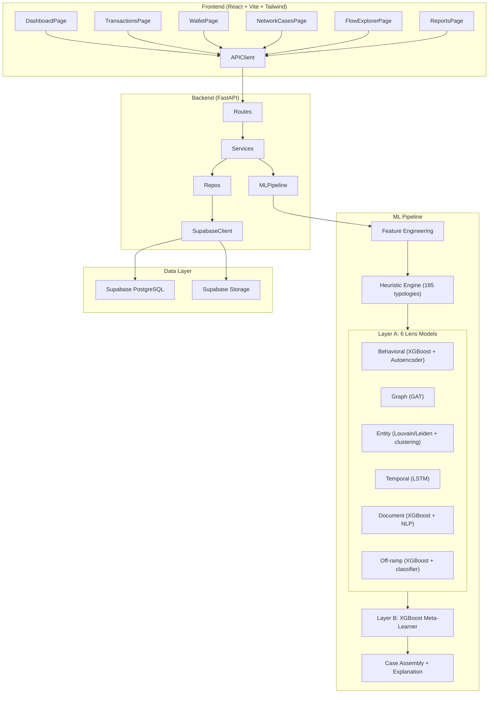
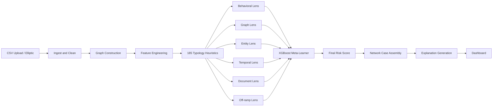

# Aegis AML: Full Implementation Plan

## Detection Objective and Non-Goal

Primary objective: produce a **risk-ranked queue of suspicious activity** with measurable quality by typology and segment (asset, chain, customer class, jurisdiction).

Explicit non-goal: "identify all money laundering cases." In AML this is not achievable; the system is judged by **coverage, recall, precision, and investigation efficiency** under uncertainty.

Required operating targets (to be tuned per deployment cohort):
- Typology-level recall floor and precision floor for high-priority typologies
- False positives per 1,000 transactions ceiling by segment
- Precision@K for analyst queue quality
- Time-to-detection and time-to-investigate reduction

## Architecture Overview



## Data Flow (Heuristics-First Pipeline)



## Key Design Principle: Heuristics First, Models Second

The pipeline enforces a strict ordering:

1. **Heuristics run first**: 185 typology-specific rules each check for one known laundering pattern and output a triggered flag, confidence score, applicability status, and explanation string. These are deterministic and explainable.
2. **Lens models run second**: Each of the 6 lens models receives the heuristic output vector (185 scores) as additional input features alongside its own lens-specific features. This lets the models learn correlations between known patterns and also detect **novel patterns** not covered by the 185 heuristics.
3. **Meta-model combines**: The 6 lens scores + aggregated heuristic signals feed the final XGBoost meta-learner.

The 185 typologies are treated as a **known-pattern floor**, not a ceiling. The ML models exist specifically to catch what the heuristics miss.

Critical guardrail: if required data for a heuristic is missing, the heuristic must return `applicability=inapplicable_missing_data` (never silent `false`). This prevents false confidence and preserves auditability.

---

## Phase 1: Project Scaffolding

### Backend (`backend/`)

- Initialize FastAPI app with the full folder structure from the spec
- `backend/requirements.txt` with pinned deps: `fastapi`, `uvicorn`, `supabase`, `pandas`, `numpy`, `scikit-learn`, `xgboost`, `lightgbm`, `torch`, `torch-geometric`, `networkx`, `python-louvain`, `shap`, `pydantic`, `python-multipart`, `python-dotenv`, `joblib`, `leidenalg`, `igraph`
- `backend/app/main.py` - FastAPI app with CORS, router registration
- `backend/app/config.py` - Pydantic Settings loading from `.env`
- `backend/app/supabase_client.py` - Supabase client singleton
- `backend/app/dependencies.py` - FastAPI dependency injection (get_db, get_graph, get_models)
- `backend/app/utils/logger.py` - Structured logging setup
- `backend/app/utils/time_utils.py` - Timestamp parsing, time-window helpers
- `backend/app/utils/file_utils.py` - CSV reading, model path resolution
- `backend/.env.example` with all vars:
  ```
  APP_ENV=development
  API_PORT=8000
  FRONTEND_PORT=5173
  SUPABASE_URL=
  SUPABASE_KEY=
  SUPABASE_SERVICE_ROLE_KEY=
  SUPABASE_BUCKET_RAW=raw-datasets
  SUPABASE_BUCKET_REPORTS=reports
  SUPABASE_BUCKET_MODELS=model-artifacts
  MODEL_DIR=./models
  BEHAVIORAL_MODEL_PATH=./models/behavioral/xgboost_behavioral.pkl
  BEHAVIORAL_AE_PATH=./models/behavioral/autoencoder_behavioral.pt
  GRAPH_MODEL_PATH=./models/graph/gat_model.pt
  ENTITY_MODEL_PATH=./models/entity/entity_classifier.pkl
  TEMPORAL_MODEL_PATH=./models/temporal/lstm_model.pt
  DOCUMENT_MODEL_PATH=./models/document/document_classifier.pkl
  OFFRAMP_MODEL_PATH=./models/offramp/offramp_classifier.pkl
  META_MODEL_PATH=./models/meta/meta_model.pkl
  THRESHOLD_POLICY_PATH=./models/artifacts/threshold_config.json
  FALLBACK_RISK_THRESHOLD=0.75
  NETWORK_HOPS=3
  ```

### Frontend (`frontend/`)

- Scaffold with `npm create vite@latest` (React + TypeScript)
- Install: `tailwindcss`, `@tailwindcss/vite`, `react-router-dom`, `cytoscape`, `react-cytoscapejs`, `plotly.js`, `react-plotly.js`, `@supabase/supabase-js`, `axios`, `lucide-react`
- Set up routing in `App.tsx` with 6 pages
- Create `frontend/src/api/client.ts` with Axios base config
- Create `frontend/src/api/supabase.ts` with Supabase client
- Create `frontend/src/utils/formatters.ts` - Number, date, risk-level formatters
- Create `frontend/src/utils/graphTransform.ts` - Transform API graph data to Cytoscape elements

### Root

- `docker-compose.yml` for backend + frontend
- `.gitignore` (Python, Node, .env, models/, data/, __pycache__, .venv, node_modules)
- `Makefile` with common commands (dev, train, ingest, test, lint)
- `README.md`

### Empty directory stubs

- `data/raw/`, `data/processed/`, `data/external/` (with `.gitkeep`)
- `models/behavioral/`, `models/graph/`, `models/entity/`, `models/temporal/`, `models/document/`, `models/offramp/`, `models/meta/`, `models/artifacts/` (with `.gitkeep`)
- `notebooks/`, `scripts/`, `docs/`

---

## Phase 2: Database (Supabase Migrations)

Create `supabase/config.toml` with project config.

Create SQL migration files in `supabase/migrations/`:

- **001_create_transactions.sql**: `transactions` table (id UUID PK, transaction_id TEXT UNIQUE, tx_hash TEXT, sender_wallet TEXT NOT NULL, receiver_wallet TEXT NOT NULL, amount NUMERIC NOT NULL, asset_type TEXT, chain_id TEXT, timestamp TIMESTAMPTZ NOT NULL, fee NUMERIC, label TEXT, label_source TEXT, created_at TIMESTAMPTZ DEFAULT now()). Indexes on sender_wallet, receiver_wallet, timestamp, label.
- **002_create_wallets.sql**: `wallets` table (id UUID PK, wallet_address TEXT UNIQUE NOT NULL, chain_id TEXT, first_seen TIMESTAMPTZ, last_seen TIMESTAMPTZ, total_in NUMERIC DEFAULT 0, total_out NUMERIC DEFAULT 0, created_at TIMESTAMPTZ DEFAULT now()). Index on wallet_address.
- **003_create_edges.sql**: `edges` table (id UUID PK, sender_wallet TEXT NOT NULL, receiver_wallet TEXT NOT NULL, transaction_id TEXT REFERENCES transactions(transaction_id), amount NUMERIC, timestamp TIMESTAMPTZ). Indexes on sender_wallet, receiver_wallet.
- **004_create_heuristic_results.sql**: `heuristic_results` table (id UUID PK, transaction_id TEXT REFERENCES transactions(transaction_id), heuristic_vector JSONB NOT NULL, applicability_vector JSONB NOT NULL, triggered_ids JSONB NOT NULL, triggered_count INT, top_typology TEXT, top_confidence FLOAT, explanations JSONB, scored_at TIMESTAMPTZ DEFAULT now()). UNIQUE on transaction_id. Index on triggered_count, top_typology. `heuristic_vector` stores 185 scores; `applicability_vector` stores per-typology applicability status.
- **005_create_transaction_scores.sql**: `transaction_scores` (id UUID PK, transaction_id TEXT UNIQUE REFERENCES transactions(transaction_id), behavioral_score FLOAT, behavioral_anomaly_score FLOAT, graph_score FLOAT, entity_score FLOAT, temporal_score FLOAT, document_score FLOAT, offramp_score FLOAT, meta_score FLOAT, predicted_label TEXT, explanation_summary TEXT, scored_at TIMESTAMPTZ DEFAULT now()).
- **006_create_wallet_scores.sql**: `wallet_scores` (id UUID PK, wallet_address TEXT UNIQUE REFERENCES wallets(wallet_address), risk_score FLOAT, fan_in_score FLOAT, fan_out_score FLOAT, velocity_score FLOAT, exposure_score FLOAT, scored_at TIMESTAMPTZ DEFAULT now())
- **007_create_network_cases.sql**: `network_cases` (id UUID PK, case_name TEXT, typology TEXT, risk_score FLOAT, total_amount NUMERIC, start_time TIMESTAMPTZ, end_time TIMESTAMPTZ, explanation TEXT, graph_snapshot_path TEXT, created_at TIMESTAMPTZ DEFAULT now()) + junction table `network_case_wallets` (case_id UUID FK, wallet_address TEXT FK)
- **008_create_reports.sql**: `reports` (id UUID PK, case_id UUID REFERENCES network_cases(id), title TEXT, report_path TEXT, generated_at TIMESTAMPTZ DEFAULT now())
- **009_create_document_events.sql**: `document_events` (id UUID PK, entity_id TEXT, transaction_id TEXT NULL, doc_type TEXT, parsed_fields JSONB, quality_score FLOAT, created_at TIMESTAMPTZ DEFAULT now())
- **010_create_entity_links.sql**: `entity_links` (id UUID PK, wallet_address TEXT, entity_id TEXT, link_type TEXT, link_strength FLOAT, source TEXT, created_at TIMESTAMPTZ DEFAULT now())
- **011_create_address_tags.sql**: `address_tags` (id UUID PK, wallet_address TEXT, tag TEXT, tag_source TEXT, confidence FLOAT, valid_from TIMESTAMPTZ, valid_to TIMESTAMPTZ NULL)
- **012_create_model_metrics.sql**: `model_metrics` (id UUID PK, model_name TEXT, cohort_key TEXT, metric_name TEXT, metric_value FLOAT, window_start TIMESTAMPTZ, window_end TIMESTAMPTZ, created_at TIMESTAMPTZ DEFAULT now())
- **013_create_threshold_policies.sql**: `threshold_policies` (id UUID PK, cohort_key TEXT UNIQUE, alert_threshold FLOAT, case_threshold FLOAT, created_at TIMESTAMPTZ DEFAULT now(), updated_at TIMESTAMPTZ DEFAULT now())
- **014_create_rls_policies.sql**: RLS policies for all tables (enable RLS, create policies for authenticated read/write)
- **seed.sql**: Sample seed data for development (10-20 transactions, 5-10 wallets, sample heuristic results, sample scores, sample tags and entity links)

---

## Phase 3: Data Ingestion Pipeline

### Files to create:

- `backend/app/api/routes_ingest.py` - POST `/api/ingest/csv` (upload CSV), POST `/api/ingest/elliptic` (load Elliptic dataset)
- `backend/app/services/ingest_service.py` - Parse CSV, validate schema, normalize columns, deduplicate, create wallet records, time-sort, time-aware train/val/test split
- `backend/app/services/cleaning_service.py` - Handle missing values, type coercion, outlier capping
- `backend/app/schemas/transaction.py` - Pydantic models for transaction input/output
- `backend/app/schemas/wallet.py` - Pydantic models for wallet input/output
- `backend/app/schemas/network_case.py` - Pydantic models for network case
- `backend/app/schemas/explanation.py` - Pydantic models for explanation responses
- `backend/app/schemas/report.py` - Pydantic models for report
- `backend/app/repositories/transactions_repo.py` - Supabase CRUD for transactions table
- `backend/app/repositories/wallets_repo.py` - Supabase CRUD for wallets table
- `backend/app/repositories/scores_repo.py` - Supabase CRUD for transaction_scores and wallet_scores
- `backend/app/repositories/network_cases_repo.py` - Supabase CRUD for network_cases and junction table
- `backend/app/repositories/reports_repo.py` - Supabase CRUD for reports table

### Elliptic dataset loader:

- Download/load `elliptic_txs_features.csv`, `elliptic_txs_edgelist.csv`, `elliptic_txs_classes.csv`
- Map Elliptic columns to our schema (166 features -> our feature set, classes -> labels)
- Store in Supabase and local `data/` folder

### Data contract and coverage tiers (required)

- Implement `backend/app/schemas/data_contract.py` with required/optional fields per lens:
  - Tier 0 (on-chain only): transactions, wallets, edges, tags
  - Tier 1 (on-chain + intelligence): + address tags, sanctions/exchange/ransomware lists
  - Tier 2 (full hybrid): + KYC/entity links + document events
- Implement `backend/app/services/data_availability_service.py` to emit per-record flags used in scoring.
- Every inference result must include:
  - `coverage_tier` (`tier0`, `tier1`, `tier2`)
  - `applicability_summary` (how many of 185 rules were applicable vs inapplicable)
  - `confidence_cap_reason` when key data is missing
- Label governance in ingestion:
  - store `label_source` (`elliptic`, `internal_sar`, `analyst_review`, `external_partner`)
  - store `label_timestamp`
  - block future-leaking labels during training split generation

---

## Phase 4: Graph Construction

### Files:

- `backend/app/services/graph_service.py` - Build directed temporal graph with NetworkX
  - Wallet graph (nodes=wallets, edges=transfers)
  - Transaction graph (nodes=txs, edges=flows)
  - Edge attrs: amount, token, timestamp, tx_hash
  - Node features: degree, amount stats, timing stats, neighborhood risk, centrality
- `backend/app/utils/graph_utils.py` - Helpers for k-hop expansion, subgraph extraction, motif detection
- `backend/app/ml/graph_features.py` - Compute graph-level features for each node (centrality scores, clustering coefficient, etc.)

---

## Phase 5: Feature Engineering

Three feature families, implemented in:

- `backend/app/ml/transaction_features.py` - **Transaction features**: amount, log(amount), fee, token type, time deltas, sender/receiver repeat counts, round-number indicator, burstiness, deviation from historical pattern
- `backend/app/ml/graph_features.py` - **Wallet/neighborhood features**: in/out degree, weighted volume, fan-in/fan-out ratio, unique counterparties, centrality, 1-hop/2-hop risky neighbor ratio, clustering coefficient, relay pattern score
- `backend/app/ml/subgraph_features.py` - **Subgraph/sequence features**: hop count in time window, fragmentation/reconvergence/peel-chain/circularity/synchronized transfer/velocity scores, entropy of fund splitting
- `backend/app/services/feature_service.py` - Orchestrator that calls all three and produces combined feature matrix

---

## Phase 6: Heuristic Engine (185 Typology Rules)

The heuristic engine is a structured rule system where each of the 185 known typologies from the Money Laundering Typologies Atlas gets its own detection function. Heuristics run **before** the ML models and produce a 185-dimensional score vector per transaction/wallet.

### Important: The 185 typologies are NOT exhaustive

The heuristics serve as a known-pattern floor. The lens models (Phase 7) are specifically designed to catch novel, unknown patterns that fall outside these 185. Every heuristic also feeds the models as input features, so the ML learns correlations between known signals.

### Heuristic output per transaction

Each heuristic returns:
- `triggered`: bool (did this pattern fire?)
- `confidence`: float 0.0-1.0 (how strongly does the evidence match?)
- `explanation`: string (plain-English reason, e.g. "14 sub-threshold transfers in 8 minutes")
- `lens_tags`: list of which lenses this heuristic is relevant to (for routing to lens models)
- `applicability`: enum (`applicable`, `inapplicable_missing_data`, `inapplicable_out_of_scope`)
- `evidence`: structured dict with values used by the rule (counts, amounts, time windows, counterparties)

### File structure: `backend/app/ml/heuristics/`

- `base.py` - Abstract `BaseHeuristic` class with `evaluate(tx, wallet, graph, features) -> HeuristicResult`
- `registry.py` - Central registry that maps heuristic ID (1-185) to class, name, environment, lens tags, data requirements, and supported coverage tiers. Also supports registering custom heuristics beyond 185 for extensibility.
- `runner.py` - Execute all registered heuristics for a transaction/wallet, produce the full 185-score vector + triggered list + explanations dict. Handles parallelism and error isolation.
- `completeness.py` - Validation contract: exactly 185 unique IDs, no overlap, no missing IDs, and environment mapping checksum.

### Heuristic modules by environment

**`traditional.py`** - Patterns 1-90 (adapted for on-chain analogs where applicable)

On-chain detectable examples:
- #1 Cash structuring / smurfing -> Detect repeated sub-threshold transfers, many branches, same beneficiary
- #5 Round-dollar deposits -> Detect repeated fixed-amount transfers
- #6 Rapid cash in then wire out -> Short holding periods, near-zero ending balance
- #17 Loan-back scheme -> Circular funding patterns
- #21 Nested personal accounts -> Frequent transfers among related parties
- #22 Funnel accounts -> Deposits from many sources, single receiver
- #23 Pass-through accounts -> Large gross flows, low average balance
- #26 Mirror transfers -> Near-simultaneous mirrored amounts
- #31 Dormant account activation -> Behavioral break from account history
- #35 ACH micro-splitting -> High count low-value transfers to related endpoints

Patterns requiring off-chain data (implemented as stubs that activate when external data is provided):
- #2 Cash-intensive front business, #28 Shell-company invoice payments, #41-58 Trade-based patterns, etc.

**`blockchain.py`** - Patterns 91-142 (fully implementable on-chain)

All have direct on-chain detection logic:
- #91 Peel chain - sequential transfers with residual balance pattern
- #92 Fan-out dispersal - high out-degree burst detection
- #93 Fan-in aggregation - high in-degree concentration
- #94 Layered hops across fresh wallets - young address age + one-time use
- #95 Dusting and mixed inflows - many small UTXOs
- #96 Self-transfer chain - common control heuristics
- #97 Address hopping around blacklists - repeated novel addresses
- #98 Time-delay layering - consistent timed gaps
- #99 Micro-splitting around thresholds - clustered near-threshold sizes
- #100 Consolidation after obfuscation - many relays converge
- #101-119 Change abuse, CoinJoin, mixers, privacy coins, bridges, DEX, etc.
- #120-142 DEX wash pathing, flash loans, NFT wash sales, L2 hopping, DAO abuse, etc.

**`hybrid.py`** - Patterns 143-155, 176-185

Cross-rail patterns where on-chain components are detectable:
- #143 KYC-borrowed account cashout - identity mismatch patterns
- #144 P2P exchange laundering - many counterparties
- #145 Crypto ATM cashout - frequent kiosk-linked patterns
- #176 Sanctions-evasion stablecoin corridor - exposure to sanctioned jurisdictions
- #179 Ransomware proceeds layering - exposure to known ransomware wallets
- #181 Darknet marketplace settlement - darknet cluster exposure
- #180 Pig-butchering scam treasury - known scam cluster interactions + fiat cashout behavior
- #184 Terror-finance micro-transfer webs - sparse but coordinated micro flows

**`ai_enabled.py`** - Patterns 156-175

Detect the behavioral signatures that AI-enabled laundering creates:
- #161 Automated transaction scheduling - clockwork timing, 24/7 consistency
- #162 Reinforcement-learned threshold avoidance - dynamic near-threshold behavior
- #163 Graph-aware route optimization - routing avoids screened clusters
- #164 Botnet wallet orchestration - synchronized activity across wallets
- #165 Autonomous cross-chain execution - complex multi-step flows with inhuman latency
- #172 Adversarial behavior against AML models - behavioral drift after review events
- #175 Multi-agent laundering workflow - distributed but coordinated indicators

### Typology ownership contract (airtight mapping)

- Traditional: 1-90
- Blockchain: 91-142
- Hybrid: 143-155 and 176-185
- AI-enabled: 156-175

No typology ID may belong to more than one environment module. Enforce this in CI via `completeness.py`.

### Common red flags (cross-cutting, Section 6 of atlas)

Implemented as 10 additional utility functions in `backend/app/ml/heuristics/common_red_flags.py` that are used as building blocks by many heuristics:
1. Fragmented transactions just below thresholds
2. Rapid movement with minimal retained balances
3. Circular or self-referential flows
4. Many-to-one or one-to-many patterns
5. Mismatch between documents and reality
6. High-risk counterparty exposure
7. New entities handling high-value flows instantly
8. Proxy/nominee/mule account patterns
9. Profits without coherent economics
10. Short jump from tainted inflows to cash-out

---

## Phase 7: 6 Lens Models (Layer A)

Each lens model receives two categories of input:
1. **Heuristic features**: The 185-score vector from Phase 6 (filtered to typologies tagged for this lens)
2. **Lens-specific engineered features**: From Phase 5 feature engineering

Each lens model is designed to catch **both** known patterns (boosted by heuristic signals) **and** novel patterns (learned from feature distributions).
Each lens also receives `data_availability_flags` so missing off-chain data does not masquerade as "clean" behavior.

### Lens-to-Heuristic Tag Mapping

Each of the 185 heuristics is tagged with one or more lenses it's relevant to. The lens model receives the subset of heuristic scores tagged for it, plus the full feature vector.

### 1. Behavioral Lens Model

**Goal**: Detect economically unnecessary activity - too many hops, too many entities, sudden changes, circular flows, transfers without business purpose.

**Architecture**: XGBoost classifier + Autoencoder for novelty detection

**Inputs**:
- Heuristic scores tagged "behavioral" (e.g. #1 structuring, #5 round amounts, #17 loan-back, #23 pass-through, #96 self-transfer chains, #105 cross-wallet loops)
- Transaction features: amount, log(amount), fee, round-number indicator, burstiness, deviation from historical pattern
- Wallet features: total_in/total_out ratio, unique counterparties, average path depth

**Outputs**: behavioral_score (float), behavioral_anomaly_score (float from autoencoder)

**Files**:
- `backend/app/ml/lenses/behavioral_model.py` - Train + inference
- `models/behavioral/xgboost_behavioral.pkl`, `models/behavioral/autoencoder_behavioral.pt`

### 2. Graph Lens Model

**Goal**: Detect structural graph anomalies - fan-out, fan-in, relays, loops, clusters with synchronized timing, bridges between separate communities.

**Architecture**: GAT (Graph Attention Network) via PyTorch Geometric

**Inputs**:
- Heuristic scores tagged "graph" (e.g. #91 peel chain, #92 fan-out, #93 fan-in, #100 consolidation, #102 CoinJoin, #119 wallet cluster fragmentation)
- Graph features: in/out degree, weighted volume, fan-in/fan-out ratio, centrality scores, 1-hop/2-hop suspicious neighbor ratio, clustering coefficient, relay pattern score
- Node features from graph construction

**Outputs**: graph_score (float), node embeddings (for clustering)

**Files**:
- `backend/app/ml/lenses/graph_model.py` - GAT definition, train, inference
- Convert NetworkX to PyG Data objects
- 2-layer GAT with multi-head attention
- `models/graph/gat_model.pt`, `models/graph/graph_config.json`, `models/graph/node_mapping.json`

### 3. Entity Lens Model

**Goal**: Resolve common control and identify cooperating wallet clusters using devices, IPs, KYC overlaps, shared gas sponsors, shared counterparties.

**Architecture**: Louvain/Leiden community detection + DBSCAN on graph embeddings + entity resolution classifier

**Inputs**:
- Heuristic scores tagged "entity" (e.g. #96 self-transfer, #110 gas sponsorship distancing, #119 wallet cluster fragmentation, #135 airdrop farming/sybil, #141 exchange mule ring, #164 botnet orchestration)
- Entity features: shared counterparty count, gas sponsor overlap, timing synchronization, device/IP overlap (when available)
- Graph embeddings from Graph Lens

**Outputs**: entity_score (float), cluster_id, cluster_risk_score

Fallback policy: if KYC/device/IP signals are missing, model emits `entity_score` with downgraded confidence and sets `entity_lens_mode=limited`.

**Files**:
- `backend/app/ml/lenses/entity_model.py`
- `backend/app/services/clustering_service.py` - Louvain/Leiden + DBSCAN
- `models/entity/entity_classifier.pkl`

### 4. Temporal Lens Model

**Goal**: Detect temporal anomalies - bursts, repeat intervals, overnight processing, rapid movement, short holding periods, bot-like cadence.

**Architecture**: LSTM sequence model

**Inputs**:
- Heuristic scores tagged "temporal" (e.g. #6 rapid in/out, #31 dormant activation, #98 time-delay layering, #161 automated scheduling, #162 threshold avoidance, #165 autonomous execution)
- Temporal features per wallet: ordered transaction sequences with (amount, time_delta, direction, counterparty_risk)
- Subgraph features: velocity score, synchronized transfer score, burstiness

**Outputs**: temporal_score (float)

**Files**:
- `backend/app/ml/lenses/temporal_model.py` - LSTM definition, train, inference
- `models/temporal/lstm_model.pt`

### 5. Document Lens Model

**Goal**: Compare metadata, invoices, contracts, source-of-funds narratives against external facts. In blockchain context: detect mismatches between stated purpose and on-chain behavior, flag synthetic/AI-generated document indicators.

**Architecture**: XGBoost classifier + optional NLP for narrative analysis

**Inputs**:
- Heuristic scores tagged "document" (e.g. #28 shell-company invoices, #41-55 trade-based patterns, #156 synthetic identity, #160 AI-written invoices, #168 document laundering via image models, #171 synthetic beneficial-owner narratives)
- Document features: metadata consistency scores, narrative complexity metrics, template repetition detection
- Note: This lens activates fully when off-chain document data is provided. With on-chain only data, it operates in reduced mode using transaction metadata patterns.
 - In reduced mode, cap document contribution in the meta-model and expose `document_lens_mode=limited` in explanations.

**Outputs**: document_score (float)

**Files**:
- `backend/app/ml/lenses/document_model.py`
- `models/document/document_classifier.pkl`

### 6. Off-ramp Lens Model

**Goal**: Detect conversion signals near exchanges, OTC desks, property, luxury goods, payroll, business revenue. The highest-value signals often appear near the point of integration.

**Architecture**: XGBoost classifier focused on exit/conversion patterns

**Inputs**:
- Heuristic scores tagged "offramp" (e.g. #93 fan-in aggregation, #106 OTC broker layering, #120 tokenized gift-card cashout, #141 exchange mule ring, #143-155 hybrid off-ramp patterns, #145 crypto ATM cashout, #146 prepaid debit off-ramp)
- Off-ramp features: proximity to known exchange addresses, cash-out pattern scores, conversion timing, exit concentration, exposure to tagged entities, inbound suspicious score

**Outputs**: offramp_score (float)

**Files**:
- `backend/app/ml/lenses/offramp_model.py`
- `models/offramp/offramp_classifier.pkl`

### Lens-to-Typology Coverage Matrix

Each typology maps to one or more lenses. Examples:

- #91 Peel chain -> Graph + Temporal + Behavioral
- #92 Fan-out dispersal -> Graph + Temporal
- #107 Bridge hop obfuscation -> Graph + Off-ramp
- #132 NFT wash sale -> Behavioral + Entity + Off-ramp
- #161 Automated scheduling -> Temporal + Behavioral
- #164 Botnet orchestration -> Entity + Temporal + Graph
- #176 Sanctions stablecoin corridor -> Off-ramp + Graph + Entity

---

## Phase 8: Meta-Model (Layer B)

- `backend/app/ml/train_meta.py` - XGBoost meta-learner
  - Inputs (19 features):
    - 6 lens scores: behavioral_score, graph_score, entity_score, temporal_score, document_score, offramp_score
    - 1 anomaly signal: behavioral_anomaly_score
    - Heuristic aggregates: total_triggered_count, max_heuristic_confidence, behavioral_heuristic_mean, graph_heuristic_mean, entity_heuristic_mean, temporal_heuristic_mean, document_heuristic_mean, offramp_heuristic_mean
    - Applicability aggregates: applicable_rule_count, inapplicable_rule_count
    - Data availability flags: has_entity_intel, has_document_intel
  - Output: final risk probability + predicted label
  - Calibration with Platt scaling or isotonic calibration (choose best on validation)
  - Threshold policy learned per cohort (chain, asset, customer segment) and written to threshold policy artifact/table
  - Save artifacts:
    - `models/meta/meta_model.pkl` - trained meta-model
    - `models/artifacts/threshold_config.json` - risk threshold configuration
    - `models/artifacts/metrics_report.json` - evaluation metrics from training
    - `models/artifacts/feature_importance.json` - SHAP / XGBoost feature importances

---

## Phase 9: Inference Pipeline + Case Assembly

- `backend/app/ml/infer_pipeline.py` - End-to-end scoring with strict ordering:
  1. Load all models + heuristic registry
  2. Compute features for new data + data availability flags
  3. **Step 1**: Run all 185 heuristics -> produce heuristic vector, triggered list, explanations
  4. **Step 2**: Run each lens model (heuristic outputs + lens features as input)
  5. **Step 3**: Stack lens outputs into meta-model
  6. **Step 4**: Apply threshold policy by cohort (`threshold_policies` table, fallback to artifact, final fallback env value)
  7. Output: transaction risk, wallet risk, cluster risk, full heuristic report, coverage tier, uncertainty flags

- `backend/app/services/scoring_service.py` - Orchestrate inference, write heuristic results + scores to Supabase
- `backend/app/services/investigation_service.py` - Network case assembly:
  - Expand k-hops from high-risk nodes
  - Search shared neighbors, detect motifs
  - Identify cluster boundaries
  - Generate "case" record with attached heuristic evidence + explicit rationale for why policy threshold was crossed

- `backend/app/services/explanation_service.py` - For each case:
  - Which heuristics fired and with what confidence
  - Which lenses contributed most to the score
  - Suspicious pattern type (mapped to typology atlas categories)
  - Likely laundering stage (placement / layering / integration)
  - Plain-English explanation using template system + SHAP values
- `backend/app/ml/explainers.py` - SHAP explanations for XGBoost models (behavioral, off-ramp, meta)

---

## Phase 10: API Routes

All routes in `backend/app/api/`:

- **routes_ingest.py**: `POST /api/ingest/csv`, `POST /api/ingest/elliptic`
- **routes_transactions.py**: `GET /api/transactions` (paginated, filterable), `GET /api/transactions/{id}`, `POST /api/transactions/score`
- **routes_wallets.py**: `GET /api/wallets`, `GET /api/wallets/{address}`, `GET /api/wallets/{address}/graph`
- **routes_heuristics.py** (new): `GET /api/heuristics/registry` (list all 185 with metadata), `GET /api/heuristics/{transaction_id}` (heuristic results for a tx), `GET /api/heuristics/stats` (aggregate stats: most-triggered heuristics, distribution by environment/lens)
- **routes_networks.py**: `GET /api/networks`, `GET /api/networks/{id}`, `GET /api/networks/{id}/graph`, `POST /api/networks/detect`
- **routes_explanations.py**: `GET /api/explanations/{transaction_id}`, `GET /api/explanations/case/{case_id}`
- **routes_reports.py**: `GET /api/reports`, `POST /api/reports/generate/{case_id}`, `GET /api/reports/{id}/download`
- **routes_metrics.py** (new): `GET /api/metrics/typology`, `GET /api/metrics/cohort`, `GET /api/metrics/drift`
- **routes_policies.py** (new): `GET /api/policies/thresholds`, `PUT /api/policies/thresholds/{cohort_key}`

Pydantic schemas in `backend/app/schemas/` for all request/response models. Add `heuristic.py` schema for heuristic results.
Repository layer in `backend/app/repositories/` for Supabase queries. Add `heuristics_repo.py`.

---

## Phase 11: Frontend Dashboard

### Shared Components (`frontend/src/components/`)

- `RiskSummaryCards.tsx` - Stat cards (suspicious tx count, wallets, cases, confidence)
- `TransactionTable.tsx` - Sortable, filterable table with risk badges + heuristic trigger count column
- `NetworkGraph.tsx` - Cytoscape.js graph component (color by risk, edge thickness by amount)
- `FlowTimeline.tsx` - Plotly timeline of fund movement
- `ExplanationPanel.tsx` - Collapsible panel showing plain-English reasons, heuristic evidence, lens contributions
- `HeuristicBadges.tsx` (new) - Display which of the 185 heuristics triggered for a transaction, grouped by environment (Traditional/Blockchain/Hybrid/AI-enabled) and tagged by lens
- `LensRadarChart.tsx` (new) - Radar/spider chart showing the 6 lens scores for a transaction or wallet
- `FiltersBar.tsx` - Date range, risk threshold, typology filter, environment filter, lens filter
- `WalletDetailPanel.tsx` - Wallet summary sidebar
- `CaseReportCard.tsx` - Case summary card with typology atlas references

### Pages (`frontend/src/pages/`)

- **DashboardPage.tsx**: Overview stats, top triggered heuristics chart, top risk typologies, lens score distribution, recent suspicious activity feed
- **TransactionsPage.tsx**: Full transaction table, risk score column, 6 lens scores, heuristic trigger count, click to expand heuristic detail + SHAP explanation
- **WalletPage.tsx**: Wallet detail view, in/out graph mini-view, related suspicious paths, entity cluster membership
- **NetworkCasesPage.tsx**: List of detected cases, typology tags (linked to atlas), amount involved, heuristic evidence summary, click to expand
- **FlowExplorerPage.tsx**: Full Cytoscape.js interactive graph, expand nodes, time slider, path trace, risk heatmap overlay, heuristic overlay mode (color nodes by which heuristics triggered)
- **ReportsPage.tsx**: Generated case reports, download PDF, summary for presentation, heuristic evidence appendix

### API Layer (`frontend/src/api/`)

- `client.ts`, `transactions.ts`, `wallets.ts`, `networks.ts`, `reports.ts`, `heuristics.ts` (new)

### Types (`frontend/src/types/`)

- `transaction.ts`, `wallet.ts`, `network.ts`, `report.ts`, `heuristic.ts` (new)

### Hooks (`frontend/src/hooks/`)

- `useTransactions.ts`, `useWallet.ts`, `useNetworkCases.ts`, `useHeuristics.ts` (new)

---

## Phase 12: Integration, Metrics, and Polish

### Metrics (`backend/app/utils/metrics.py`)

Classification metrics:
- Precision, Recall, F1, PR-AUC, ROC-AUC, confusion matrix, balanced accuracy, MCC
- Precision/Recall with confidence intervals (bootstrap)

Ranking metrics:
- Precision@K, Recall@K, Top-K hit rate

Graph/case metrics:
- Suspicious cluster purity, suspicious cluster recall, path detection success, mean suspicious path length, time-to-detection, false positives per 1,000 transactions

Investigation usefulness metrics (for demo reporting):
- Number of risky cases surfaced, average explanation coverage, reduction in analyst search space, percentage of cases with traceable source-to-destination path

Governance metrics (required for production posture):
- Typology-level recall and precision table (all 185 IDs; explicit N/A when inapplicable)
- Segment/cohort metrics (by chain, asset type, customer type, jurisdiction)
- Calibration error (ECE/Brier) and threshold stability by cohort
- Drift metrics (PSI/feature drift, label drift) with alert thresholds

Performance gates (must pass before promoting models):
- High-priority typology recall floor met
- False positives per 1,000 transactions below cohort policy ceiling
- Calibration error below target
- No critical regression against previous champion model

Hackathon emphasis: Precision, Recall, F1, PR-AUC, Precision@K, and measurable time-to-investigate improvement with explicit uncertainty disclosure.

### Services

- `backend/app/services/report_service.py` - Generate downloadable case reports (JSON + optional PDF)
- `backend/app/services/storage_service.py` - Upload/download from Supabase storage buckets (raw-datasets, reports, model-artifacts)

### Backend tests (`backend/tests/`)

- `test_ingest.py` - CSV parsing, schema validation, deduplication
- `test_features.py` - Feature computation correctness
- `test_graph.py` - Graph construction, k-hop expansion
- `test_heuristics.py` - All 185 heuristic rules trigger correctly on known patterns, registry completeness, runner error isolation, no duplicated/missing typology IDs
- `test_lenses.py` - Each lens model produces valid scores, accepts heuristic input correctly
- `test_scoring.py` - Full pipeline inference (heuristics -> lenses -> meta), meta-model stacking
- `test_api.py` - API endpoint integration tests including heuristic endpoints
- `test_data_contract.py` - Coverage tier assignment and missing-data applicability behavior
- `test_threshold_policy.py` - Policy precedence (`threshold_policies` -> artifact -> fallback env)
- `test_leakage.py` - Time-split integrity, no future feature leakage, no target leakage in engineered features
- `test_eval_protocol.py` - Out-of-time and out-of-entity validation pipeline correctness
- `test_drift_monitoring.py` - Drift detection and alerting path

### Integration

- Connect all frontend pages to live API endpoints
- End-to-end test: CSV upload -> scoring -> case generation -> visualization
- Verify Supabase storage bucket operations (upload raw CSV, download report)
- Champion/challenger run: compare current production model vs new candidate on the same holdout and produce promotion decision report

---

## Key Technical Decisions

- **Backend framework**: FastAPI (async, good for ML serving)
- **Frontend**: React 18 + Vite + TypeScript + Tailwind CSS v4
- **Graph viz**: Cytoscape.js via `react-cytoscapejs`
- **Charts**: Plotly.js via `react-plotly.js`
- **Database**: Supabase PostgreSQL (existing project)
- **Graph library**: NetworkX (Python) for construction, PyTorch Geometric for GAT
- **ML stack**: XGBoost (behavioral + offramp + document + meta), PyTorch (GAT for graph lens, LSTM for temporal lens, Autoencoder for behavioral anomaly), scikit-learn (preprocessing)
- **Community detection**: python-louvain + leidenalg (entity lens)
- **Heuristic engine**: 185 typology-specific rules from Money Laundering Typologies Atlas, extensible registry
- **Explainability**: SHAP for XGBoost models, template-based for heuristics, lens contribution breakdown
- **Detection target**: risk-ranked suspicious activity, not exhaustive laundering capture
- **Threshold governance**: cohort-based threshold policies with explicit fallback chain and audit trail
- **Validation protocol**: out-of-time + out-of-entity evaluation, typology-level scorecards, drift monitoring
- **Dataset**: Elliptic Bitcoin Dataset + custom CSV support

---

## Complete File Manifest

Total files to create: ~115+

**Backend** (65+ files):
- `backend/app/`: main.py, config.py, supabase_client.py, dependencies.py
- `backend/app/api/`: routes_ingest.py, routes_transactions.py, routes_wallets.py, routes_heuristics.py, routes_networks.py, routes_explanations.py, routes_reports.py, routes_metrics.py, routes_policies.py
- `backend/app/schemas/`: transaction.py, wallet.py, heuristic.py, network_case.py, explanation.py, report.py, data_contract.py
- `backend/app/services/`: ingest_service.py, cleaning_service.py, feature_service.py, graph_service.py, scoring_service.py, explanation_service.py, clustering_service.py, investigation_service.py, report_service.py, storage_service.py, data_availability_service.py
- `backend/app/repositories/`: transactions_repo.py, wallets_repo.py, heuristics_repo.py, scores_repo.py, network_cases_repo.py, reports_repo.py
- `backend/app/ml/heuristics/`: base.py, registry.py, runner.py, completeness.py, traditional.py, blockchain.py, hybrid.py, ai_enabled.py, common_red_flags.py
- `backend/app/ml/lenses/`: behavioral_model.py, graph_model.py, entity_model.py, temporal_model.py, document_model.py, offramp_model.py
- `backend/app/ml/`: train_meta.py, infer_pipeline.py, graph_features.py, transaction_features.py, subgraph_features.py, explainers.py
- `backend/app/utils/`: logger.py, time_utils.py, graph_utils.py, file_utils.py, metrics.py
- `backend/tests/`: test_ingest.py, test_features.py, test_graph.py, test_heuristics.py, test_scoring.py, test_api.py, test_lenses.py, test_data_contract.py, test_threshold_policy.py, test_leakage.py, test_eval_protocol.py, test_drift_monitoring.py
- `backend/`: requirements.txt, Dockerfile, .env.example

**Frontend** (30+ files):
- `frontend/src/`: main.tsx, App.tsx
- `frontend/src/pages/`: DashboardPage.tsx, TransactionsPage.tsx, WalletPage.tsx, NetworkCasesPage.tsx, FlowExplorerPage.tsx, ReportsPage.tsx
- `frontend/src/components/`: RiskSummaryCards.tsx, TransactionTable.tsx, WalletDetailPanel.tsx, NetworkGraph.tsx, FlowTimeline.tsx, ExplanationPanel.tsx, HeuristicBadges.tsx, LensRadarChart.tsx, FiltersBar.tsx, CaseReportCard.tsx
- `frontend/src/api/`: client.ts, transactions.ts, wallets.ts, heuristics.ts, networks.ts, reports.ts, supabase.ts
- `frontend/src/types/`: transaction.ts, wallet.ts, heuristic.ts, network.ts, report.ts
- `frontend/src/hooks/`: useTransactions.ts, useWallet.ts, useNetworkCases.ts, useHeuristics.ts
- `frontend/src/utils/`: formatters.ts, graphTransform.ts
- `frontend/`: package.json, vite.config.ts, tailwind.config.js, tsconfig.json

**Supabase** (16 files):
- `supabase/`: config.toml, seed.sql
- `supabase/migrations/`: 001 through 014 .sql files

**Model directories** (with .gitkeep):
- `models/behavioral/`, `models/graph/`, `models/entity/`, `models/temporal/`, `models/document/`, `models/offramp/`, `models/meta/`, `models/artifacts/`

**Root** (5 files):
- docker-compose.yml, .gitignore, Makefile, README.md
